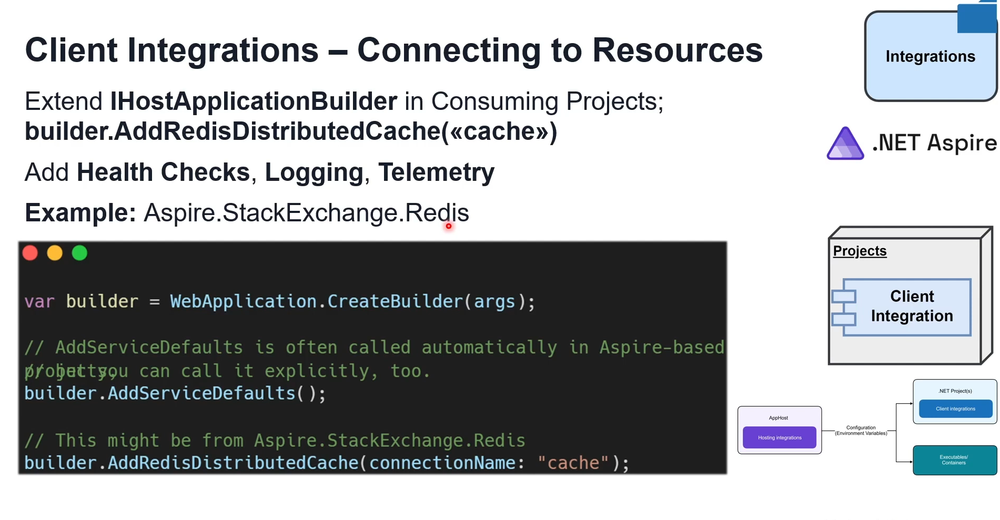

# GenAI-Aspire
.NET Aspire and Generative AI
- This is what we will build:
- 
- .Net Aspire simplifies building distributed enterprise ready applications by providing a clean project structure and built in solution for configuration logging and so on.
- 
- We will deploy to Azure Container Apps
- We will use Microsoft.Extensions.AI package and Semantic Kernel Library to add GenAI capabilities.
- Here Catalog and Basket communicate with each other using .Net Aspire
- 
- We will build a Blazor Application for the UI
- This will also be deployed to Azure Container Apps
- We will use Semantic Search using Vector Database.
- This is the project structure:
- 

## What is Cloud Native Distributed Architecture
- 
- 
- 
- 
- 
- 

## What is .NET Aspire
- 
- 
- 

### Core Concepts of .NET Aspire
- 
- 
- 
- 
- In .Net Aspire, we can say that orchestration ensures each service and backing services is containerized and started in the correct order
- .Net Aspire Integrations lets you effortlessly add databases, caches, messaging systems or identity providers as a backing services
- Service discovery binds everything together, allowing microservices to find each other without manual configuration.
- This synergy makes .Net Aspire an excellent choice for the teams who want to build cloud native and event driven distributed solutions quickly and reliably.

### .Net Aspire Integration
- 
- 
- 
- 
- 
- 

### .Net Aspire Integrations - Built in Connectors
- 
- 
- 
- 
- Hosting Integration is all about provisioning and attaching resources
- Client integration is all about reading environment variables and connection strings and setting up connection with the provisioned resources. It automatically sets us telemetry, logging and health checks
- 
- 
- 
- 
- 
- 
- 

### .Net Aspire Service Discovery
- 
- 
- 
- 
- 

## Building the first .NET Aspire Application
